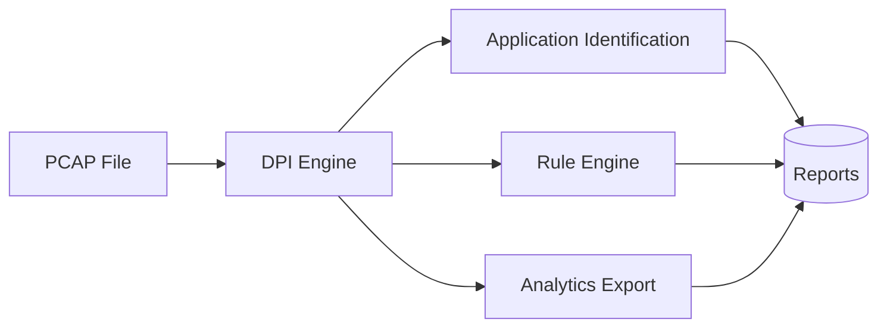
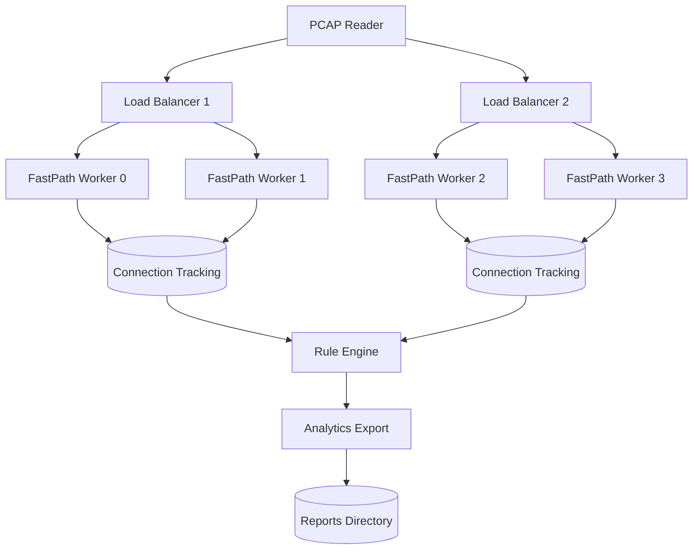
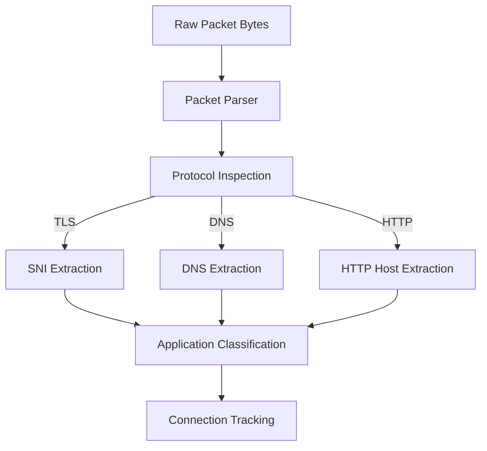
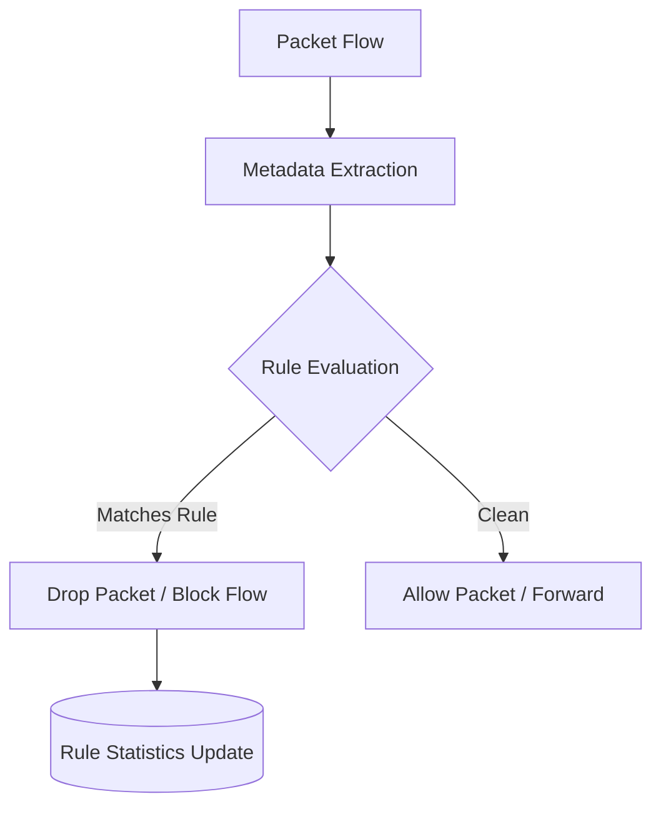
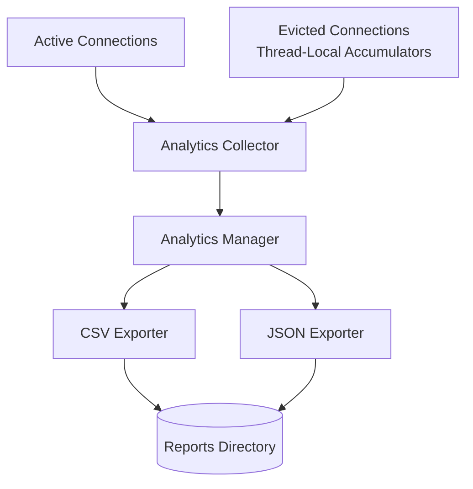
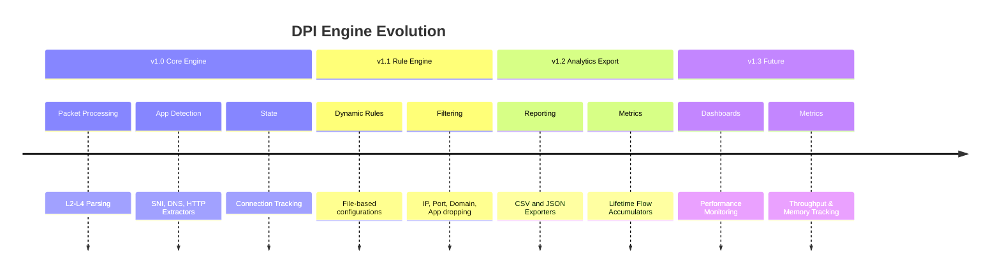

<div align="center">
  <h1>DPI Engine</h1>
  <p><b>Multi-threaded Deep Packet Inspection Engine built in Java 21</b></p>
  
  <p>
    
    
    
    
  </p>
</div>

DPI Engine is a high-performance, multi-threaded Deep Packet Inspection (DPI) system built in Java 21. Designed for rigorous network traffic analysis, it provides deterministic application identification, granular rule-based traffic filtering, robust connection tracking, and comprehensive offline analytics export. 

Engineered with zero external dependencies, the platform leverages advanced concurrent data structures and producer-consumer paradigms to parse and analyze PCAP files at scale through a concurrent processing pipeline.



### Project Metrics

| Metric                 | Value |
| ---------------------- | ----- |
| Java Version           | 21    |
| Source Files           | 28    |
| Implemented Releases   | 3     |
| Supported Applications | 16    |
| Report Types           | 9     |
| Rule Types             | 4     |

---

## Table of Contents
- [Overview](#overview)
- [Motivation](#motivation)
- [Capabilities](#capabilities)
- [System Overview](#system-overview)
  - [Core Architecture](#core-architecture)
  - [Packet Processing Pipeline](#packet-processing-pipeline)
  - [Rule Engine](#rule-engine)
  - [Analytics Export](#analytics-export)
- [Getting Started](#getting-started)
  - [Build Instructions](#build-instructions)
  - [Usage](#usage)
  - [Execution Example](#execution-example)
- [Configuration and Outputs](#configuration-and-outputs)
  - [Rule Configurations](#rule-configurations)
  - [Analytics Reports](#analytics-reports)
- [Technical Details](#technical-details)
  - [Performance Characteristics](#performance-characteristics)
  - [Design Decisions](#design-decisions)
  - [Codebase Organization](#codebase-organization)
- [Project Evolution](#project-evolution)
  - [Roadmap](#roadmap)
  - [Learning Outcomes](#learning-outcomes)
- [License](#license)

---

## Overview

The DPI Engine processes raw network captures to extract metadata traversing the Ethernet, IPv4, TCP, and UDP layers. Moving up the stack, it identifies Layer 7 protocols by parsing HTTP Host headers, DNS queries, and TLS Client Hello SNI (Server Name Indication) extensions.

Once classified, traffic is evaluated against a dynamic rule engine capable of dropping packets based on IP, Port, Subdomain, or Application identifiers. Upon engine termination, a snapshot export model dumps perfectly preserved lifetime statistics to disk via CSV and JSON formats.

## Motivation

This project was built to demonstrate advanced Java systems engineering capabilities, specifically:
- High-performance, low-contention architecture.
- Custom binary protocol parsing utilizing native standard libraries.
- Architectural design patterns suitable for large-scale network sensors.
- State management and memory safety in environments prone to combinatorial explosion (e.g., DNS exhaustion).

## Capabilities

### Protocol & Application Support
* **Layers 2-4**: Ethernet, IPv4, TCP, UDP parsing.
* **Layer 7 Extraction**: TLS SNI, DNS Queries, HTTP Host Headers.
* **Application Identification**: Native mapping for 16 major platforms including YouTube, GitHub, Discord, Netflix, Facebook, Instagram, Telegram, Spotify, Google, Microsoft, Zoom, Apple, Amazon, TikTok, Cloudflare, and Twitter/X.

### Filtering & Analytics
* **Dynamic Rule Engine**: Real-time traffic dropping based on user-defined configurations.
* **Domain Exhaustion Protection**: Implements a strict 50,000 domain memory cap, safeguarding the JVM heap against randomized SNI floods or malware DGAs.
* **Lifetime Analytics**: Captures 100% of packet and byte counts through thread-local analytics accumulators even after stale flows are evicted from active tracking tables.

---

## System Overview

### Core Architecture

The DPI Engine utilizes a robust producer-consumer architecture. A primary reader thread dispatches raw packets to Load Balancer threads, which subsequently hash traffic into multiple Fast Path (FP) worker queues to ensure flows are strictly serialized per worker.



### Packet Processing Pipeline

The Fast Path workers execute a strict processing pipeline for every packet, progressing from low-level byte manipulation to Layer 7 metadata extraction.



### Rule Engine

The Rule Engine (v1.1) supports strict and wildcard-aware blocking mechanisms.



### Analytics Export

To maintain a low-contention architecture on the fast-path threads, the Analytics Export subsystem (v1.2) utilizes thread-local accumulators. Evicted flows securely dump their terminal state into localized maps, which are merged universally at engine shutdown.



---

## Getting Started

### Build Instructions

This project requires **Java 21** and **Maven**.

```bash
# Clone the repository
git clone https://github.com/NamanKejriwal/DPI-Engine
cd dpi-engine

# Build the project
mvn clean package
```

The resulting artifact will be located at `target/dpi-engine-1.0-SNAPSHOT.jar`.

### Usage

To execute the DPI Engine against a PCAP file, pass the input and output paths as positional arguments:

```bash
java -jar target/dpi-engine-1.0-SNAPSHOT.jar trace.pcap filtered.pcap --rules blocklist.txt --verbose
```

### Execution Example

```text
[DPIEngine] Processing: trace.pcap
[DPIEngine] Output to:  filtered.pcap

[DPIEngine] All threads started
[Reader] Starting packet processing...
[Reader] Finished reading 77 packets
[DPIEngine] All threads stopped

╔══════════════════════════════════════════════════════════════╗
║                    DPI ENGINE STATISTICS                      ║
╠══════════════════════════════════════════════════════════════╣
║ PACKET STATISTICS                                             ║
║   Total Packets:                77                        ║
║   Total Bytes:               11334                        ║
║   TCP Packets:                  73                        ║
║   UDP Packets:                   4                        ║
...

==================================================
RULE STATISTICS
==================================================
Blocked By Domain: 0
Blocked By IP: 0
Blocked By Port: 0
Blocked By Application: 0

Total Blocked Flows: 0

==================================================

[AnalyticsManager] Reports successfully exported to reports/

Processing completed successfully in 0.88 seconds.
```

---

## Configuration and Outputs

### Rule Configurations

The engine supports dynamic rules provided via an external text file. Subdomain-aware domain matching correctly drops traffic destined for `www.facebook.com` when `BLOCK_DOMAIN=facebook.com` is configured.

**Example `blocklist.txt`**:
```ini
BLOCK_DOMAIN=facebook.com
BLOCK_APP=YouTube
BLOCK_IP=8.8.8.8
BLOCK_PORT=443
```

### Analytics Reports

The Analytics Export subsystem automatically writes the following files to the output directory upon execution:

```text
reports/
├── summary.json
├── applications.csv
├── domains.csv
├── connections.csv
├── rules.csv
├── top-talkers.csv
├── application-distribution.json
├── domain-distribution.json
└── report-metadata.json
```

* **`summary.json`**: High-level statistical overview of the run, providing total packet and connection throughput metrics.
* **`applications.csv`**: Detailed traffic usage mapping total bytes and packets directly to identified applications (e.g., YouTube, Google).
* **`domains.csv`**: Aggregation of the most frequently requested SNI and DNS hostnames across the PCAP lifecycle.
* **`connections.csv`**: Raw snapshot dump of all currently active 5-tuple flows at the exact moment of engine termination.
* **`rules.csv`**: Efficacy summary of the Dynamic Rule Engine containing total counts of flows blocked by each rule type.
* **`top-talkers.csv`**: Source IP address activity index ranked by total connection establishment counts.
* **`application-distribution.json`**: Pre-calculated percentage distributions for application traffic, ready for dashboard consumption.
* **`domain-distribution.json`**: Pre-calculated percentage distributions for domain activity.
* **`report-metadata.json`**: Provenance details containing engine versions, execution timestamps, and benchmarked processing times.

#### Report Examples

**`summary.json`**
```json
{
  "totalPackets": 77,
  "tcpPackets": 73,
  "udpPackets": 4,
  "connections": 43,
  "blockedFlows": 0,
  "runtimeMs": 880
}
```

**`applications.csv`**
```csv
Application,Connections,Packets,Bytes,Percentage
Unknown,21,21,1134,48.84
DNS,4,4,300,9.30
YouTube,1,3,247,2.33
Google,1,3,246,2.33
```

**`domains.csv`**
```csv
Domain,Connections,Percentage
www.facebook.com,2,9.09
www.google.com,2,9.09
```

**`top-talkers.csv`**
```csv
IP,ConnectionCount
192.168.1.100,22
192.168.1.50,5
```

---

## Technical Details

### Performance Characteristics

* **Zero External Dependencies**: Ensures tightly controlled memory allocations and strict compliance with core JVM paradigms.
* **Multi-Threaded Packet Processing**: Packet processing pipelines rely exclusively on single-writer, single-reader concurrent queues. No highly contented synchronized blocks impede the packet parsing loop.
* **OOM-Safe Tracking**: Aggressive connection eviction limits active heap footprints. The Thread-Local analytics accumulators are strictly capped (50,000 domains) to mitigate algorithmic complexity attacks.
* **Asynchronous Reporting**: Analytics generation executes sequentially after processing loops terminate, completely eliminating I/O bottlenecks from the fast path.

### Design Decisions

| Component | Design Decision | Rationale |
| :--- | :--- | :--- |
| **Parsing Layer** | Custom Byte Extractors | Native byte manipulation provides highly predictable allocation patterns over heavy abstractions. |
| **Concurrency** | Producer-Consumer | Allows horizontal scaling of FastPath threads based on CPU core availability. |
| **Analytics** | Snapshot + Accumulators | Retaining raw connection objects causes memory exhaustion. Rolling metrics into cumulative thread-local maps maintains data integrity with minimal overhead. |

### Codebase Organization

```text
com.packetanalyzer
├── analytics    # Report generation, CSV/JSON serialization, Collectors
├── engine       # DpiEngine orchestrator, FastPath, LoadBalancers
├── extractors   # Layer 7 payload parsers (SNI, HTTP, DNS)
├── io           # PCAP Reader/Writer, Byte manipulation utilities
├── parser       # L2-L4 Packet Parser implementation
├── rules        # Dynamic Rule Engine, Rule parsers, Subdomain matching
├── tracking     # Connection lifecycle, Thread-local accumulators
└── types        # DTOs, Enums, FiveTuples, PacketJobs, AppTypes
```

---

## Project Evolution

### Roadmap



**Status Summary:**
* ✅ **v1.0** Core DPI Engine
* ✅ **v1.1** Dynamic Rule Engine
* ✅ **v1.2** Analytics Export
* 🚧 **v1.3** Performance Dashboard (Planned)

### Learning Outcomes

This project demonstrates proficiency in:
* Advanced Java concurrency (`LinkedBlockingQueue`, `AtomicLong`, `ReentrantReadWriteLock`).
* Network stack internals (binary protocol anatomy, byte-order conversions).
* Application architecture (Dependency decoupling, SOLID principles, scalable subsystems).
* Memory management strategies (Eviction policies, object pooling theories, accumulator patterns).

---
