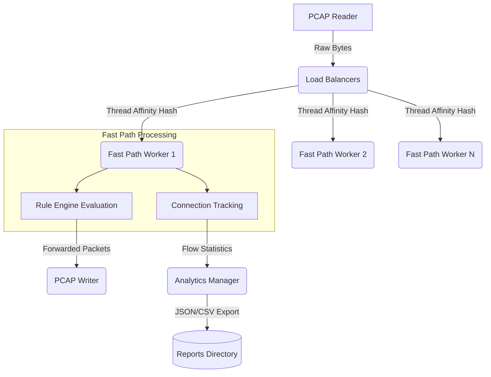
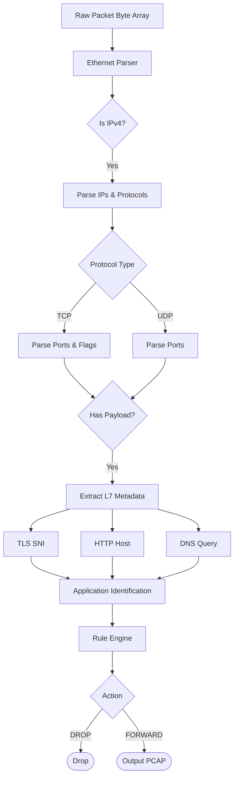
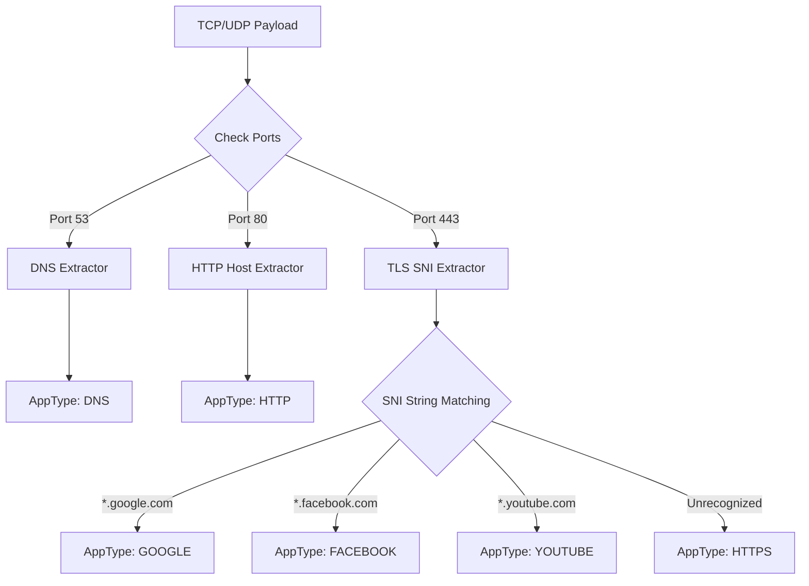
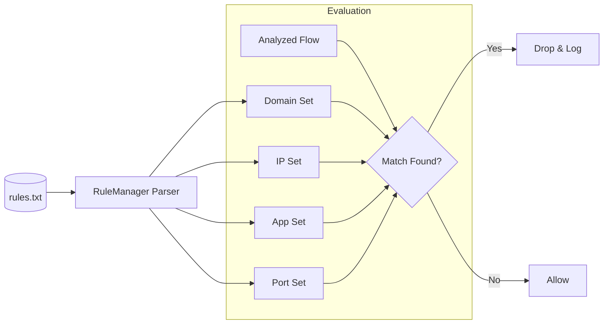
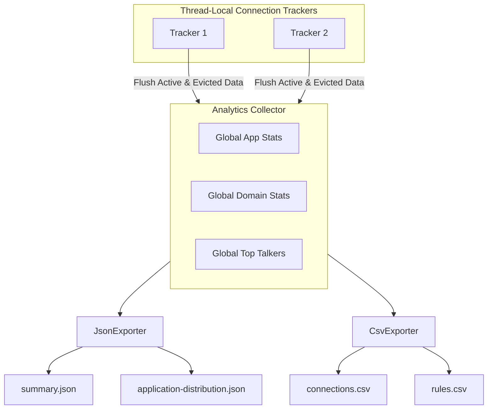
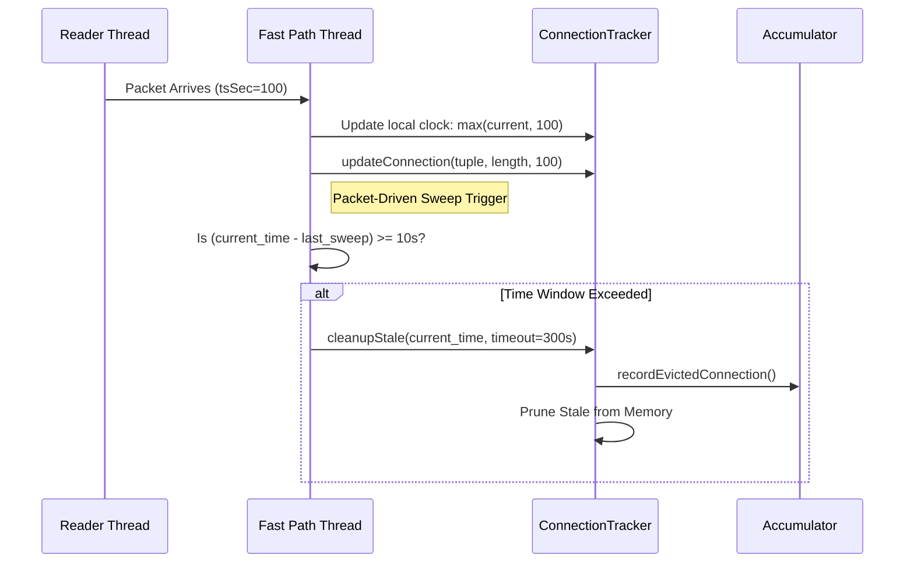
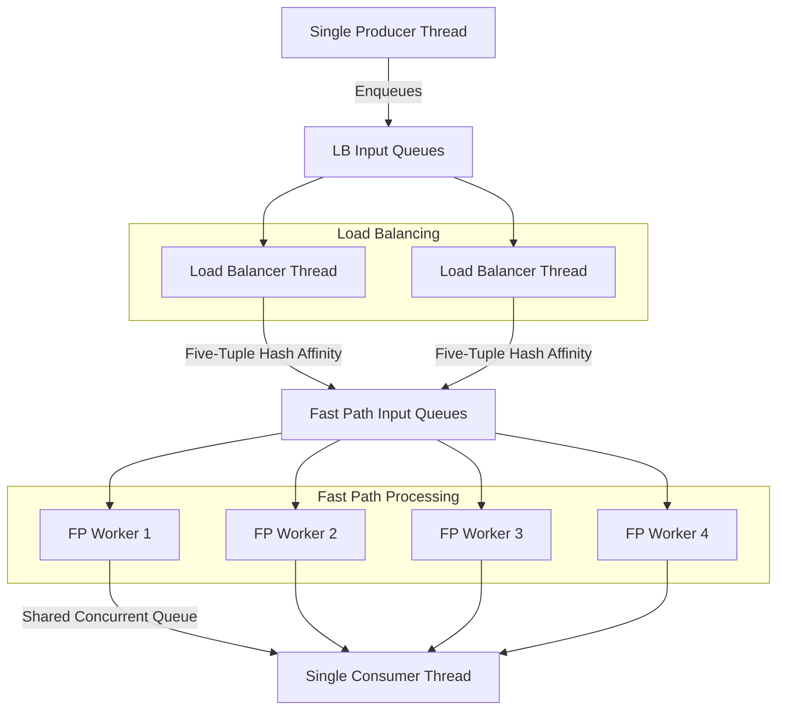
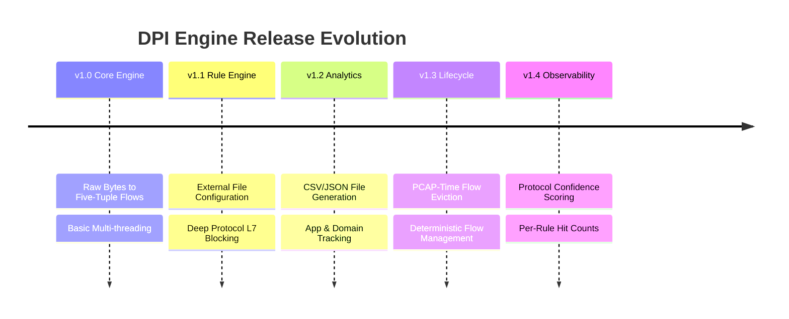

<div align="center">

# DPI Engine

**Multi-threaded Deep Packet Inspection & Network Traffic Analysis Engine**

[](#)
[](#)
[](#)

A concurrent Deep Packet Inspection (DPI) system built in Java 21 for offline network traffic analysis, application identification, custom traffic filtering, connection tracking, analytics export, and deterministic flow lifecycle management.

</div>

---

## Highlights

- Multi-threaded DPI Engine built in Java 21
- Five-Tuple Flow Tracking
- Layer 7 Application Identification
- PCAP-Time Flow Lifecycle Management
- Domain/IP/Port/Application Filtering
- CSV & JSON Analytics Pipeline
- Protocol Confidence Scoring
- Flow-Based Rule Telemetry

---

## Skills Demonstrated

- Java 21
- Multithreading
- Producer–Consumer Architecture
- Concurrent Collections
- Network Protocol Parsing
- Deep Packet Inspection
- TCP/IP Networking
- Flow Tracking
- PCAP Processing
- Analytics Pipelines

---

## Feature Matrix

| Capability | Status |
|------------|---------|
| Multi-threaded Processing | ✅ |
| Five-Tuple Flow Tracking | ✅ |
| Layer 7 Classification | ✅ |
| Rule Engine | ✅ |
| Analytics Export | ✅ |
| Flow Lifecycle Management | ✅ |
| Protocol Confidence Scoring | ✅ |
| Per-Rule Hit Counts | ✅ |

---

## Table of Contents

- [Overview](#overview)
- [Project Metrics](#project-metrics)
- [Why This Project Exists](#why-this-project-exists)
- [Key Features](#key-features)
- [System Architecture](#system-architecture)
- [Packet Processing Pipeline](#packet-processing-pipeline)
- [Application Classification Pipeline](#application-classification-pipeline)
- [Rule Engine Architecture](#rule-engine-architecture)
- [Analytics Export Architecture](#analytics-export-architecture)
- [Flow Lifecycle Management (v1.3)](#flow-lifecycle-management-v13)
- [Concurrency Model](#concurrency-model)
- [Project Structure](#project-structure)
- [Supported Protocols](#supported-protocols)
- [Supported Applications](#supported-applications)
- [Generated Reports](#generated-reports)
- [Installation](#installation)
- [Build Instructions](#build-instructions)
- [Usage](#usage)
- [Example Terminal Output](#example-terminal-output)
- [Example Reports](#example-reports)
- [Validation Results](#validation-results)
- [Performance Characteristics](#performance-characteristics)
- [Design Decisions](#design-decisions)
- [Technical Challenges Solved](#technical-challenges-solved)
- [Release Summary](#release-summary)
- [Release History](#release-history)
- [Key Technical Concepts](#key-technical-concepts)
- [Learning Outcomes](#learning-outcomes)
- [License](#license)

---

## Overview

DPI Engine is a batch-processing network traffic analysis tool built to ingest `.pcap` files, reconstruct stateful flows, classify traffic by application, and generate deep analytics regarding network behavior.

Designed around a multi-threaded producer-consumer pipeline, the engine provides bounded connection-state memory through configurable flow lifecycle management and deterministic flow eviction.

---

## Project Metrics

| Metric | Value |
|----------|----------|
| Java Version | 21 |
| Source Files | 29 |
| Supported Applications | 16 |
| Report Types | 9 |
| Rule Types | 4 |
| Processing Model | Multi-threaded |

---

## Why This Project Exists

Traditional stateless packet filters and firewalls make decisions exclusively on IP headers and transport ports, providing an incomplete view of network usage. DPI Engine implements Layer-7 payload analysis to determine exact application origins (e.g., distinguishing YouTube traffic from Google Search traffic over the same IP range). 

This project serves as a comprehensive system demonstrating protocol parsing, concurrent data-structures, stateful networking semantics, and memory-safe batch processing paradigms.

---

## Key Features

**Core Analysis**
- PCAP ingestion and output generation
- Raw byte parsing for Ethernet, IPv4, TCP, and UDP protocols
- Stateful Five-Tuple connection tracking

**Deep Packet Inspection**
- Passive DNS query interception and parsing
- HTTP Host header extraction
- TLS Server Name Indication (SNI) extraction

**Custom Filtering**
- Dynamic rule engine configuration
- L3-L7 blocking capabilities (IP, Port, Domain, Application)

**Observability**
- High-fidelity CSV and JSON reporting
- Perfect analytics preservation across flow eviction cycles
- Terminal-based system observability

---

## System Architecture



---

## Packet Processing Pipeline



---

## Application Classification Pipeline



---

## Rule Engine Architecture



---

## Analytics Export Architecture



---

## Flow Lifecycle Management (v1.3)

To process massive files without triggering an `OutOfMemoryError`, DPI Engine v1.3 implements a deterministic, PCAP-time-driven flow eviction model.

### Why PCAP Time Instead of Wall Clock Time?

Traditional timeout systems use wall-clock timers. For offline packet processing, this creates incorrect behavior because a capture containing several hours of traffic may be processed in only a few seconds.

DPI Engine therefore performs eviction using packet timestamps extracted from the PCAP itself, ensuring deterministic and reproducible flow management regardless of processing speed.



---

## Protocol Confidence Scoring (v1.4)

### Problem Statement
Network traffic often utilizes common ports (e.g., 443) for varying protocols, and sometimes applications run on non-standard ports. Without knowing how a flow was classified, users cannot gauge the reliability of the classification.

### Why Confidence Scoring Was Needed
DPI Engine uses multiple extraction techniques: deterministic Layer 7 payload parsing (highly accurate) and port-based fallbacks (less accurate). Exposing the confidence level allows downstream analytics to filter or weight results based on classification accuracy.

### Confidence Model

The engine employs a straightforward `HIGH`, `MEDIUM`, `LOW` confidence model directly tied to the deterministic strength of the extraction.

| Confidence | Source                  |
| ---------- | ----------------------- |
| HIGH       | TLS SNI, HTTP Host      |
| MEDIUM     | DNS                     |
| LOW        | Port fallback / Unknown |

### Design Decisions
To maintain optimal memory performance and O(1) flow eviction, confidence scores are tracked strictly for active flows. When a flow is evicted due to timeout, its historical packet and byte counts are aggregated, but individual confidence states are intentionally discarded.

### Example Output
The `connections.csv` export now includes the `Confidence` column:
```csv
SourceIP,DestinationIP,Application,PacketCount,State,Confidence
192.168.1.5,142.250.190.46,HTTPS,14,CLASSIFIED,HIGH
10.0.0.2,8.8.8.8,DNS,2,CLASSIFIED,MEDIUM
```

---

## Per-Rule Hit Counts (v1.4)

### Problem Statement
Previously, the engine only tracked aggregate totals of blocked flows (e.g., "Hit - By Domain: 45"). Administrators had no visibility into exactly *which* specific domains or IPs within the rule set were actively dropping traffic.

### Why Flow-Based Counting Was Chosen
Counting every single dropped packet for a blocked connection creates highly skewed metrics (a single large blocked download could register 10,000 rule hits). Flow-based counting ensures that a triggered rule is incremented exactly once per malicious connection, providing an accurate representation of adversarial intent.

### Architecture Overview
The `RuleManager` utilizes a lock-free `ConcurrentHashMap` combined with `AtomicLong` counters to track exact rule hits. The `FastPathProcessor` guarantees flow-based semantics by immediately terminating payload inspection for connections already marked as `BLOCKED`, preventing duplicate hits for subsequent packets.

### Example Output
The `rules.csv` export now lists every triggered rule and its exact flow hit count:
```csv
Rule,Type,HitCount
BLOCK_DOMAIN=www.google.com,DOMAIN,2
BLOCK_PORT=4444,PORT,8
```

---

## Concurrency Model



---

## Project Structure

```text
src/main/java/com/packetanalyzer
│
├── analytics          # Export frameworks, JSON/CSV generators
├── engine             # Core threads (LB, FastPath, DpiEngine)
├── extractors         # L7 Protocol logic (SNI, HTTP, DNS)
├── io                 # Byte manipulation, PCAP reading/writing
├── parser             # Stateless packet header deserialization
├── rules              # Dynamic rule loading and evaluation
├── tracking           # Thread-local state and connection tables
└── types              # Core data models (FiveTuple, ParsedPacket)
```

---

## Supported Protocols

| Layer | Protocol |
|--------|----------|
| L2 | Ethernet |
| L3 | IPv4 |
| L4 | TCP, UDP |
| L7 | DNS, HTTP Host, TLS SNI |

---

## Supported Applications

The L7 extraction pipeline natively classifies traffic targeting:

| Video & Streaming | Social Media | Enterprise & Tools |
| :--- | :--- | :--- |
| YouTube | Facebook | GitHub |
| Netflix | Instagram | Zoom |
| Spotify | TikTok | Microsoft |
| Apple | Twitter/X | Amazon |
| - | Telegram | Cloudflare |
| - | Discord | Google |

---

## Generated Reports

Upon completion, the engine exports zero-dependency analytics into the `reports/` directory.

| Report File | Format | Purpose |
| :--- | :--- | :--- |
| `summary.json` | JSON | High-level packet, bytes, blocking, and lifecycle stats |
| `report-metadata.json` | JSON | Engine runtime configurations and timestamps |
| `application-distribution.json` | JSON | Percentage breakdown of application traffic |
| `domain-distribution.json` | JSON | Percentage breakdown of top domain accesses |
| `applications.csv` | CSV | Raw packet, byte, and connection counts per app |
| `domains.csv` | CSV | Access counts per unique fully-qualified domain name |
| `connections.csv` | CSV | Exhaustive list of tracked active L4 connections with Confidence scoring |
| `top-talkers.csv` | CSV | Traffic counts grouped by internal IP |
| `rules.csv` | CSV | Exact hit counts for every triggered filtering rule |

---

## Installation

**Prerequisites:**
- Java 21+ JDK
- Maven 3.9.x

```bash
git clone https://github.com/NamanKejriwal/DPI-Engine.git
cd DPI-Engine/java-dpi
```

---

## Build Instructions

Compile the project and run all tests utilizing Maven:

```bash
mvn clean package
```

The executable JAR will be located at `target/dpi-engine-1.0-SNAPSHOT.jar`.

---

## Usage

**Basic Execution:**
```bash
java -jar target/dpi-engine-1.0-SNAPSHOT.jar input.pcap output.pcap
```

**Execution With Rules:**
```bash
java -jar target/dpi-engine-1.0-SNAPSHOT.jar input.pcap output.pcap -r rules.txt
```

*Note: Rules are only loaded when the `-r` or `--rules` argument is provided.*

---

## Example Terminal Output

*Note: The values below were generated during flow lifecycle validation using a temporary 1-second timeout.*

```text
╔══════════════════════════════════════════════════════════════╗
║                    DPI ENGINE v1.4                           ║
║               Deep Packet Inspection System                  ║
╠══════════════════════════════════════════════════════════════╣
║ CONFIGURATION                                                ║
║   Load Balancers:                              2             ║
║   FPs per LB:                                  2             ║
║   Total FP threads:                            4             ║
╚══════════════════════════════════════════════════════════════╝

╔══════════════════════════════════════════════════════════════╗
║ RULE ENGINE INITIALIZATION                                   ║
╠══════════════════════════════════════════════════════════════╣
║ Loaded from: rules.txt                                       ║
║   Domains:                                     1             ║
║   IPs:                                         0             ║
║   Ports:                                       1             ║
║   Applications:                                1             ║
╚══════════════════════════════════════════════════════════════╝

[DPIEngine] Processing: samples/traffic.pcap
[DPIEngine] Output to:  out.pcap

╔══════════════════════════════════════════════════════════════╗
║                    DPI ENGINE STATISTICS                     ║
╠══════════════════════════════════════════════════════════════╣
║ PACKET STATISTICS                                            ║
║   Total Packets:                           77                ║
║   Total Bytes:                          11032                ║
║   TCP Packets:                             73                ║
║   UDP Packets:                              4                ║
╠══════════════════════════════════════════════════════════════╣
║ PIPELINE STATISTICS                                          ║
║   LB Received:                             77                ║
║   LB Dispatched:                           77                ║
║   FP Processed:                            77                ║
║   FP Forwarded:                            77                ║
║   FP Dropped:                               0                ║
╠══════════════════════════════════════════════════════════════╣
║ FILTERING STATISTICS                                         ║
║   Forwarded:                               77                ║
║   Dropped/Blocked:                          0                ║
║   Drop Rate:                             0.00%               ║
╠══════════════════════════════════════════════════════════════╣
║ FLOW LIFECYCLE STATISTICS                                    ║
║   Active Flows:                             8                ║
║   Evicted Flows:                           35                ║
║   Flow Timeout:                           300 sec            ║
╠══════════════════════════════════════════════════════════════╣
║ RULE STATISTICS                                              ║
║   Loaded Rules:                             3                ║
║   Hit - By Domain:                          2                ║
║   Hit - By IP:                              0                ║
║   Hit - By Port:                            0                ║
║   Hit - By App:                             0                ║
║   Total Blocked Flows:                      2                ║
║                                                              ║
║   Top Triggered Rules:                                       ║
║     BLOCK_DOMAIN=www.google.com               2              ║
╠══════════════════════════════════════════════════════════════╣
║ EXPORT STATUS                                                ║
║   Reports Directory:                 reports/                ║
║   CSV Files:                                5                ║
║   JSON Files:                               4                ║
╚══════════════════════════════════════════════════════════════╝
```

---

## Example Reports

**`reports/summary.json`**
```json
{
  "totalPackets": 77,
  "tcpPackets": 73,
  "udpPackets": 4,
  "connections": 43,
  "activeFlows": 8,
  "evictedFlows": 35,
  "blockedFlows": 0,
  "flowTimeoutSec": 300,
  "runtimeMs": 3410
}
```

**`reports/applications.csv`**
```csv
Application,Connections,Packets,Bytes,Percentage
Unknown,21,21,1134,48.84
DNS,4,4,300,9.30
HTTPS,2,4,368,4.65
Discord,1,3,243,2.33
Amazon,1,3,246,2.33
YouTube,1,3,247,2.33
```

---

## Validation Results

The DPI Engine was validated using a representative PCAP capture containing 77 packets spanning multiple TCP and UDP flows, DNS queries, TLS handshakes, and application-identification scenarios.

### v1.4 Validation Results

| Feature                          | Status |
| -------------------------------- | ------ |
| HIGH Confidence Classification   | PASS   |
| MEDIUM Confidence Classification | PASS   |
| LOW Confidence Classification    | PASS   |
| Rule Hit Counting                | PASS   |
| Flow-Based Counting              | PASS   |
| Flow Lifecycle Regression        | PASS   |

### Functional Validation

| Metric | Result |
|----------|----------|
| Total Packets Processed | 77 |
| TCP Packets | 73 |
| UDP Packets | 4 |
| Connections Observed | 43 |
| Applications Identified | 16 |
| Reports Generated | 9 |
| Build Status | PASS |
| Analytics Export | PASS |
| Rule Engine Integration | PASS |

### Flow Lifecycle Validation

To verify flow eviction behavior, the flow timeout was temporarily reduced from the production value of **300 seconds** to **1 second**.

| Metric | Result |
|----------|----------|
| Flow Timeout | 1 second |
| Total Connections | 43 |
| Active Flows | 8 |
| Evicted Flows | 35 |
| Analytics Preservation | PASS |

### Validation Summary

The test confirms that:

- Packet processing remained fully functional after the introduction of Flow Lifecycle Management.
- Stale connections were successfully evicted using PCAP timestamps rather than wall-clock time.
- Evicted flows were preserved within the analytics pipeline before removal from memory.
- Connection accounting remained accurate (`Active Flows + Evicted Flows = Total Connections`).
- No regression was observed in application identification, rule processing, report generation, or analytics export.

## Performance Characteristics

The engine maximizes single-node hardware capabilities through its concurrent pipeline:

- **Affinity Hashing:** Five-tuple hashes guarantee that bidirectional TCP/UDP packets for any single flow invariably land on the exact same FastPath worker, negating the need for distributed connection locks.
- **Minimal Dependencies:** Zero third-party analytics libraries were imported. Parsers operate directly on byte offset logic.

---

## Design Decisions

- **Little-Endian Bias:** Network traffic bytes are big-endian, but PCAP file structures enforce host byte-ordering assumptions. A centralized custom byte parser was implemented.
- **Time Modeling:** Traditional timeouts rely on JVM wall-clock background threads (`System.nanoTime()`). Because a 3-hour PCAP file might be processed in 10 seconds, this engine abstracts time dynamically against the PCAP packet timestamps, enforcing deterministic lifecycles completely independent of hardware processing speed.
- **Eviction Hook Accumulation:** Memory constrained systems traditionally lose analytical data once stale connection objects are deleted to free RAM. The engine utilizes an intercept pattern during the cleanup lifecycle to permanently merge dying state integers into thread-local accumulators.

---

## Technical Challenges Solved

1. **State Consistency in Multithreading:** Handled by mathematical hash affinity ensuring no two threads require simultaneous access to a `Connection` object.
2. **Infinite Hash Map Growth:** Solved via inline, PCAP-driven time tracking loops integrated directly into the packet polling routine.
3. **Data Loss During Eviction:** Overcome via dedicated accumulative map architectures that decouple live-connection states from historical analytical summaries.

---

## Release Summary

| Version | Major Capability |
|----------|----------|
| v1.0 | Core DPI Engine |
| v1.1 | Dynamic Rule Engine |
| v1.2 | Analytics Export Framework |
| v1.3 | Flow Lifecycle Management |
| v1.4 | Protocol Confidence Scoring & Per-Rule Hit Counts |

---

## Release History



---

## Key Technical Concepts

This project demonstrates:

- Deep Packet Inspection (DPI)
- Layer 7 Traffic Classification
- Five-Tuple Flow Tracking
- Producer-Consumer Architecture
- Concurrent Packet Processing
- Flow Lifecycle Management
- Rule-Based Traffic Filtering
- Traffic Analytics Pipelines

---

## Learning Outcomes

This project demonstrates practical experience in:

- Systems Engineering & Network Architecture
- Concurrent System Design
- Network Protocol Parsing
- Deep Packet Inspection (DPI)
- Flow Tracking Systems
- Rule-Based Traffic Filtering
- Memory-Conscious Network Processing
- Analytics Pipeline Design

---

## License

This project is intended for educational and research purposes.
